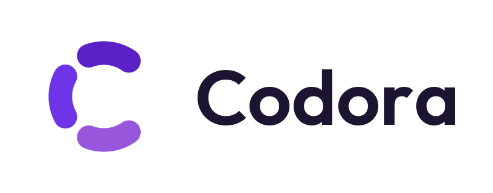
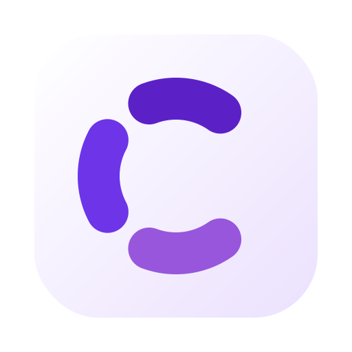

一个桌面端论坛聚合阅读器，把 V2EX、linux.do、掘金放进同一个界面里读。macOS 为主，同时保留 Windows 和 Linux 平台目录。

## 运行

```bash
flutter pub get
flutter run -d macos
```

## 界面

左边是窄轨道，每个站一个方块，右上角的小圆点表示这个站现在能读到多少内容。中间是帖子卡片流，右边是详情。窗口窄于 940 时详情改为整页打开。

板块做成两行的方块：上面是中文名，下面是这个板块在站点里的原始标识（`programmer`、`backend`、`develop`），所以按 URL 记板块的人也能直接认出来。选中的方块填成薰衣草紫，这是界面里唯一的实心强调色。回复数用奶油黄，超过 50 条才点亮。

配色、圆角、字体都在 [app_theme.dart](lib/app_theme.dart) 里，深浅两套共用一组语义色名。按钮、输入框、分段选择这些能点能输入的控件统一 `kControlHeight` 高，所以并排放时边缘对齐。

有人回复或提到你时，应用不在前台会弹系统通知，程序坞图标上标出未读数（Windows 和 Linux 没有图标角标）。在「设置 → 常规 → 通知」里可以按站点关掉。这要求能读到这个站的消息：V2EX 填了 Token，linux.do 登录后。

快捷键：`J` / `K` 或上下方向键切换帖子。

## 各站怎么接的

| 站点 | 数据 | 需要做什么 |
| --- | --- | --- |
| V2EX | 官方 v1 接口，另外「全部」抓首页 HTML | 不用。填 Token 后节点列表改走 v2 并支持翻页 |
| linux.do | Discourse JSON | 在设置里用内置浏览器过一次人机验证 |
| 掘金 | `api.juejin.cn` 前端接口，正文是 Markdown | 不用。填 Cookie 后推荐按账号来 |

V2EX 的「全部」是站点首页那个 tab，全站按最后回复排序，一页约 55 条。它没有 JSON 接口，所以解析的是浏览器拿到的同一个页面。这和「最新」不同：后者走 `latest.json`，按发帖时间给 20 条。

linux.do 的 Cloudflare 把通行凭据绑定到拿到它的那个浏览器，连 TLS 指纹一起，所以把 Cookie 复制给普通 HTTP 客户端仍然会被拒。它的接口请求因此走一个隐藏的 WebView 发同源 `fetch`，指纹和 Cookie 都与验证页一致。

图片要分开看：只有 linux.do 这个域名有质询，帖子里的图和表情都在 ldstatic.com 这个 CDN 上，那边对谁都开放，还带着
`Access-Control-Allow-Origin: *`。所以 CDN 上的图必须走普通网络请求，如果也塞进 WebView，就变成跨域请求反而取不到。
这条规则是 `LinuxDoSource.needsBrowser`，有测试盯着。

这两件事都封在 [linuxdo_source.dart](lib/sources/linuxdo_source.dart) 里，界面代码看到的还是一个普通的 `ForumSource`。

## 正文渲染

两个站给 HTML，掘金给 Markdown，所以 `ForumSource` 在 `TopicDetail` 上声明自己用哪种格式，
[post_body.dart](lib/widgets/post_body.dart) 按格式分派到 flutter_widget_from_html_core 或
flutter_markdown_plus。渲染器是内部细节：链接怎么跳、图片怎么取、字号和圆角，都在这一个文件里决定一次，
所以一篇 Markdown 帖子和一篇 HTML 帖子看起来是同一个应用。

正文里的图片统一走 [post_image.dart](lib/widgets/post_image.dart)，圆角都是 `Radii.image`，
加载不出来时显示同一个占位。只有内联表情不裁切，因为给 20px 的字形切角会把它削掉。

点正文里任意一张图会全屏打开，背景压暗，点背景、按 Esc 或点关闭都能退出。
Discourse 在缩略图背后链着原图，放大时打开的是原图而不是那张缩小的副本。

长图不缩着看。高度超过宽度 2.2 倍的图会按可读宽度渲染并垂直滚动，和它在原站上的样子一致；
其余的整幅显示，可以滚轮缩放、拖动查看。两种方式在右上角随时可以互换。

三个站的图片写法各不相同——Discourse 把图套在 lightbox 链接里并带 `srcset`，V2EX 给图加类名，
掘金用 Markdown——所以 [test/fixtures](test/fixtures) 存了三站各自的真实正文，有测试盯着它们渲染出来的圆角是同一个值。

## 代码结构

```
lib/
  core/        统一模型、ForumSource 接口、设置存储、WebView 取数
  sources/     三个站点的 ForumSource 实现
  features/    Riverpod providers、桌面外壳、设置页、linux.do 验证页
  widgets/     面板与胶囊、正文渲染、图片、头像、错误视图
```

三个站共用同一套界面组件，站点之间的差异全部声明在 `ForumSource` 上，而不是写进界面：

- `glyph`：轨道方块上的字
- `access`：当前凭据能读到什么，轨道圆点和设置页状态都由它渲染
- `accessNote`：设置页上那句说明
- `imageHeaders` / `imageLoader`：这个站的图片怎么取，取图器可以按地址逐个决定要不要接手
- `AuthRequiredException` 里的 `AuthRecovery`：失败时该把用户送去哪里

加一个新论坛，就是新增一个 `ForumSource` 实现、在 `SiteId` 里加一项、在 `sourceProvider` 里注册。界面不用动。

## 测试

```bash
flutter test
```

```bash
flutter test --dart-define=LIVE=true test/sources_live_test.dart
```

第二条会真的去请求 V2EX 和掘金。linux.do 要靠真实 WebView，`flutter test` 起不来，所以那部分只测纯逻辑，网络路径在应用里验证。

[test/fixtures](test/fixtures) 里存了三个站各自的真实正文，用来离线验证渲染器吃得下真实内容，
换新样本的命令写在那个目录的说明里。

## 品牌



标是三段弧拼成的一个 C：三个来源，一个阅读器。段间缝隙刻意做得比 C 的主开口小得多，
否则三个豁口一样大，整个标就读成加载转圈而不是字母。圆头笔帽每端还会向外多吃掉一点角度，
缝隙参数要先扣掉它才是眼睛看到的宽度，这两条约束在生成器里是断言。

三段的紫色阶直接取自 [app_theme.dart](lib/app_theme.dart)，对白底的对比度分别是 8.4:1、6.3:1、4.5:1。

矢量源和各平台图标都从一份脚本生成：

```bash
python3 tool/brand.py
```

改 logo 只改 [tool/brand.py](tool/brand.py)，重跑会一并刷新 macOS 的 `AppIcon.appiconset`、
Windows 的 `app_icon.ico` 和 [assets/brand](assets/brand) 下的 SVG。16px 与 32px 走一套单独的
光学补偿参数 —— 图形更大、笔画更粗、缝隙更张，否则菜单栏尺寸下会糊成一团。
依赖 `cairosvg` 和 `pillow`。

## 说明

只读。不会代替你发帖、回复或点赞。凭据用 `shared_preferences` 存在本机。

界面字体是 [Outfit](https://fonts.google.com/specimen/Outfit)，SIL Open Font License，许可证放在 [assets/fonts/OFL-Outfit.txt](assets/fonts/OFL-Outfit.txt)。
